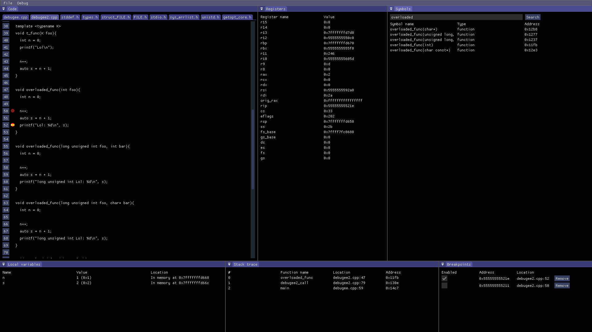

# GUI+Lib Debugger



## Features
- Debugging of specified executable
- Attaching to already running process by PID
- Reading/writing registers
- Traking of current location in source files
- Setting brekpoint at an address, at a line in source file and at a function entry
- Step over, step in, step out, single instruction step, continuing execution
- Symbol table query
- Stack trace dumping
- Local variables printing

## Usage

First compile and install libelfin dependency: https://github.com/TartanLlama/libelfin
```bash
git clone https://github.com/TartanLlama/libelfin
cd libelfin
make
make install # checkinstall is better though
```

Compile as stand-alone GUI program:
```bash
./build.sh -gui
```

Compile as statically linked library:
```bash
./build.sh -lib
```

Build test program for library API:
```bash
./build.sh -test
```
